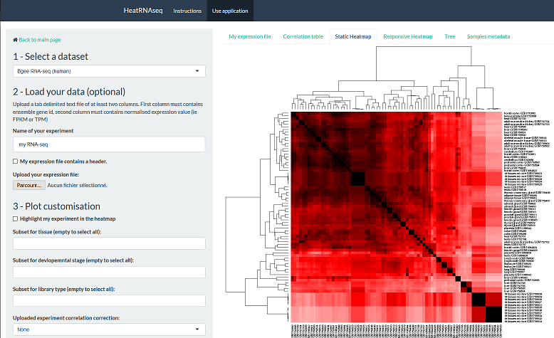

# Heat\*Seq: A R/shiny web application to browse and compare public RNA-seq / ChIP-seq / CAGE datasets
by Guillaume Devailly, Anna Mantsoki, and Anagha Joshi

Contact: [@G_Devailly](https://twitter.com/G_Devailly) / guillaume.devailly _at_ roslin.ed.ac.uk



## Summary

**[About this repository](https://github.com/gdevailly/HeatStarSeq_gh#about--this-repository)**

**[How to use Heat\*Seq](https://github.com/gdevailly/HeatStarSeq_gh#how-to-use-heatseq)**

- [The public server](https://github.com/gdevailly/HeatStarSeq_gh#the-public-server)
- [Running Heat\*Seq locally](https://github.com/gdevailly/HeatStarSeq_gh#running-heatseq-locally)
- [Creating your Heat\*Seq server](https://github.com/gdevailly/HeatStarSeq_gh#creating-your-heatseq-server)

**[How to add new datasets](https://github.com/gdevailly/HeatStarSeq_gh#how-to-add-new-datasets)**

- [Gene expression data](https://github.com/gdevailly/HeatStarSeq_gh#gene-expression-data)
- [ChIP-seq data](https://github.com/gdevailly/HeatStarSeq_gh#chip-seq-data)

## About  this repository
The `application` folder contains subfolders, each of which contains a [Shiny Application](http://shiny.rstudio.com/). The `dataset_formatting` folder contains R scripts documenting the process of pre-formatting datasets, and experimental work on the application.

## How to use Heat\*Seq

### The public server
Heat\*Seq is available [at this address](http://www.heatstarseq.roslin.ed.ac.uk/).

### Running Heat\*Seq locally
Download the Github folder (for example, from [here](https://github.com/gdevailly/HeatStarSeq_gh/archive/master.zip)). Extract the .zip archive. You will need R (version 3.2 or later), and need to install several R packages from CRAN (shiny, shinyjs, plotly, magrittr, readr, svglite, cba) and Bioconductor (GenomicRanges). Two datasets are to heavy to be included in GitHub. Please download [the FANTOM5 human CAGE dataset](https://drive.google.com/file/d/0B_p7ZTlH5xcTYXhwZnptQWlyeDA/view?usp=sharing) and the [GTEx full dataset](https://drive.google.com/file/d/0B_p7ZTlH5xcTaXZPUHdVSVJ0dXc/view?usp=sharing) and place the file into the `application/heatcageseq/data/` and `application/heatrnaseq/data/` folders respectively.
You may need to replace a line 2 of `application/heatrnaseq/ui.R`, `application/heatchipseq/ui.R` or `application/heatcageseq/ui.R`:
```R
shinyUI(tagList(useShinyjs(), tags$head(includeScript("www/google_analytics.js")), navbarPage(a(div(icon("home"), "Heat*seq"), href = URL_HEATSTARSEQ),
```
by:
```R
shinyUI(tagList(useShinyjs()), navbarPage(a(div(icon("home"), "Heat*seq"), href = URL_HEATSTARSEQ),

```
Launch R, and go to one of the three following directories `application/heatrnaseq/`, `application/heatchipseq/` and `application/heatcageseq/`, using for example the `setwd()` R command. Finally, execute the following:
```R
library(shiny)
runApp()
```
Some datasets are heavy, so you may need more than 3 Gb of free memory.

### Creating your Heat\*Seq server
Heat\*Seq is a [Shiny application](http://shiny.rstudio.com/), so you will need a **Shiny server**.
You can install the [Open source edition of Shiny server](https://github.com/rstudio/shiny-server) on any compatible web-server, or use [shinyapps.io](http://www.shinyapps.io/).

Heat\*Seq is composed of three independent Shiny Apps, [HeatStarSeq](https://github.com/gdevailly/HeatStarSeq_gh/tree/master/application/heatstarseq), [HeatRNAseq](https://github.com/gdevailly/HeatStarSeq_gh/tree/master/application/heatrnaseq) and [HeatChIPseq](https://github.com/gdevailly/HeatStarSeq_gh/tree/master/application/heatchipseq). You will need to edit the [server_adresses.R](https://github.com/gdevailly/HeatStarSeq_gh/blob/master/application/heatstarseq/data/server_adresses.R) script with the proper web url:
```R
URL_HEATSTARSEQ <- "http://www.chipcompare.roslin.ed.ac.uk"
URL_HEATRNASEQ <- "http://www.chipcompare.roslin.ed.ac.uk/heatrnaseq"
URL_HEATCHIPSEQ <- "http://www.chipcompare.roslin.ed.ac.uk/heatchipseq"
```
and copy it in the `data` folder of **each** application.
You may need to replace a line 2 of `application/heatstarseq/ui.R`, `application/heatrnaseq/ui.R`, `application/heatchipseq/ui.R` and `application/heatcageseq/ui.R`:
```R
shinyUI(tagList(useShinyjs(), tags$head(includeScript("www/google_analytics.js")), navbarPage(a(div(icon("home"), "Heat*seq"), href = URL_HEATSTARSEQ),
```
by:
```R
shinyUI(tagList(useShinyjs()), navbarPage(a(div(icon("home"), "Heat*seq"), href = URL_HEATSTARSEQ),

```
Alternatively, you can monitor your server using [google analitycs](http://shiny.rstudio.com/articles/google-analytics.html), by adding the `google_analytics.js` file in each `www` folder.
Several R packages are required, from CRAN (shiny, shinyjs, plotly, magrittr, readr, svglite, cba) and Bioconductor (GenomicRanges). Two datasets are to heavy to be included in GitHub. Please download [the FANTOM5 human CAGE dataset](https://drive.google.com/file/d/0B_p7ZTlH5xcTYXhwZnptQWlyeDA/view?usp=sharing) and the [GTEx full dataset](https://drive.google.com/file/d/0B_p7ZTlH5xcTaXZPUHdVSVJ0dXc/view?usp=sharing) and place the file into the `application/heatcageseq/data/` and `application/heatrnaseq/data/` folders respectively.
If you whish to create a mirror of Heat\*Seq, please feel free to [contact me](mailto:guillaume.devailly%20at%20roslin.ed.ac.uk") (replace at with @).

## How to add new datasets

### Gene expression data

**1) Formatting the dataset**

One needs to create an R list object, hereafter named `newDataset`, which contains the following elements (the element name matters, not the order of them in the list):
- `newDataset$dataMatrix`, a numeric matrix of one row per [GENCODE gene](http://www.gencodegenes.org/) and one column per sample. Each value should be a measure of gene expression (log10(FPKM+1) or log10(TPM+1), FPKM: Fragment Per Kilobase per Million, TPM: Transcript Per Million) for that gene in that sample. I would strongly advise to remove genes with no expression in the dataset `which(rowSums(newDataset$dataMatrix) != 0)` and to replace all NAs by 0s. Please do not name the rows and columns,
- `newDataset$geneName`, a character vector of as many elements as there are in the rows of dataMatrix, containing the [GENCODE gene](http://www.gencodegenes.org/) name of each gene, in the same order as in the dataMatrix. Use GENCODE name without the number of transcripts (ENSG00000134046 and not ENSG00000134046.5).
- `newDataset$correlationMatrix`, the output of `cor(newDataset$dataMatrix)`:
```R
newDataset$correlationMatrix <- cor(newDataset$dataMatrix)
```
- `newDataset$annotation`, a data.frame (with string as character, not factor) of one line per experiment in the dataset. The number of lines of the annotation table must be equal to the number of columns of the dataMatrix, and be in the same order. The annotation table MUST contain a `name` column containing UNIQUE character strings describing the experiment. It is strongly advised to add a `url` column storing a link to the original experiment, and to add one or more columns for subsetting the dataset, such as a cell type column or a library type column. Please, nullify the row names of the annotation table before saving the object:
```R
row.names(newDataset$annotation) <- NULL
```
- The, the `newDataset` object should be saved in the relevant directory:
```R
save(newDataset, file = "heatrnaseq/data/newDataset.RData")
```

**2) Generating a newDataset_preload.RData**

Datasets can be quite heavy, so we will load only one at a time on the shiny server. However, each dataset needs to be preloaded. One can generate a `newDataset_preload.RData` by doing the following:
```R
load("heatrnaseq/data/newDataset.RData")
nullifyDataForFasterPreloading <- function(myList) {
    myList[["dataMatrix"]] <- NULL
    myList[["geneName"]] <- NULL
    myList[["correlationMatrix"]] <- NULL
    return(myList)
}
object.size(newDataset)
newDataset <- nullifyDataForFasterPreloading(newDataset)
object.size(newDataset)
save(newDataset, file = "heatrnaseq/data/newDataset_preload.RData")
```
Which is what is done in [this script](dataset_fromating/8_data_preload_ChIPseq.R).

**3) Edit the shiny app to accept the new dataset**
- In the [global.R](application/heatrnaseq/global.R), add the following line at the end:
```R
[...]
load("data/blueprint_rnaseq_preload.RData")
load("data/newDataset_preload.RData") # <- this line
```
- In the [ui.R](application/heatrnaseq/ui.R), modify the `selectInput("dataset",` function:
```R
                    selectInput("dataset", label = NULL, choices = c(
                        "Bgee RNA-seq (human)",
                        "Blueprint RNA-seq (human)",
                        "ENCODE RNA-seq (human)",
                        "Bgee RNA-seq (mouse)",
                        "ENCODE RNA-seq (mouse)",
                        "the new dataset (relevant species)" # <- this line
                    )),
```
We will now setup the subsetting widget for the new dataset. Subsetting is done according to relevant column(s) of the `annotation` table. One can add subsetting option for cell line/tissue, library preparation method, laboratory of origin, etc. Look for the line `# we adapt filtering widgets to the various datasets` and insert a new `div` function below the other filtering widgets for other datasets:
```R
                    div(id = "widgetForNewDataset",
                        selectInput("tissue_newDataset", "Tissue of origin:",
                                    choices = unique(newDataset$annotation$tissue)[order(unique(newDataset$annotation$tissue))],
                                    selected = NULL, multiple = TRUE)
                    ),
```
Here we have detailed how to add one subsetting field, but one can include as many as she/he wants. Look for `div(id = "widgetForBgeeHuman",` to see how to include multiple filtering fields.
- In the [server.R](application/heatrnaseq/server.R), modify the second `observe({` function so that the filtering widget is displayed only when this dataset was selected:
```R
observe({
        shinyjs::hide("widgetForBgeeHuman")
        shinyjs::hide("widgetForBlueprintHuman")
        shinyjs::hide("widgetForEncodeHuman")
        shinyjs::hide("widgetForEncodeMouse")
        shinyjs::hide("widgetForBgeeMouse")
        shinyjs::hide("widgetForNewDataset") # <- insert this line, same string as in the div() defined in the ui.R

        if (input$dataset == "ENCODE RNA-seq (human)") {
            shinyjs::show("widgetForEncodeHuman")
        } else if (input$dataset == "Bgee RNA-seq (human)") {
            shinyjs::show("widgetForBgeeHuman")
        } else if (input$dataset == "Blueprint RNA-seq (human)") {
            shinyjs::show("widgetForBlueprintHuman")
        } else if (input$dataset == "ENCODE RNA-seq (mouse)") {
            shinyjs::show("widgetForEncodeMouse")
        } else if (input$dataset == "Bgee RNA-seq (mouse)") {
            shinyjs::show("widgetForBgeeMouse")
        } else if (input$dataset == "the new dataset (relevant species)") {  # <- insert this line, same sting as the dataset string defined in the ui.R
            shinyjs::show("widgetForNewDataset") # <- insert this line
        }
    })

```
Modify the `getSelectedDataset` reactive function, so that the dataset is loaded when the user selects it:
```R
    getSelectedDataset <- reactive({
        withProgress(value = 1, message = "Loading dataset: ", detail = "removing old dataset", {
            load("data/encode_rnaseq_preload.RData")
            load("data/bgee_human_preload.RData")
            load("data/encode_mouse_rnaseq_preload.RData")
            load("data/bgee_mouse_preload.RData")
            load("data/newDataset_preload.RData") # <- insert this line
            setProgress(value = 1, detail = "loading new dataset")
            if (input$dataset == "ENCODE RNA-seq (human)") {
                load("data/encode_rnaseq.RData")
                dataset <- encode_rnaseq
            } else if (input$dataset == "Bgee RNA-seq (human)") {
                load("data/bgee_human.RData")
                dataset <- bgee_human
            } else if (input$dataset == "Blueprint RNA-seq (human)") {
                [...]
            } else if (input$dataset == "the new dataset (relevant species)") {  # <- insert this line
                load("data/newDataset.RData")  # <- insert this line
                dataset <- newDataset  # <- insert this line
            }
            setProgress(value = 1, detail = "done!")
        })
        return(dataset)
    })
```
Finally, modify the tedious `subsetMatrix` reactive function, inserting the following at the bottom of the big chunk of `if else`:
```R
        } else if (input$dataset == "the new dataset (relevant species)") {
            if (is.null(input$tissue_newDataset)) { # same input line as defined in the ui.R
                temp_tissue_newDataset <- unique(newDataset$annotation$tissue)
            } else {
                temp_tissue_newDataset <- input$cells_encode_m
            }
            keep <- which(
                dataset$annotation$tissue %in% temp_tissue_newDataset
            )
        }
```
Please, look into the `} else if (input$dataset == "Bgee RNA-seq (human)") {` section to see how to include multiple filtering conditions.

After debugging for typos, missing commas, parenthesis and brackets, it should work! Please, do push a merge request if you implemented a new dataset, or updated an old one!


### ChIP-seq data

**1) Formatting the dataset**

One needs to create an R list object, hereafter named `newDataset`, which contains the following elements (the element name matters, not the order of them in the list):
- `newDataset$dataMatrix`, a boolean matrix of one row per genomic regions (there should be no overlapping region, please merge the overlapping regions) and one column per sample. A cell with `TRUE` means that that experiment (column) had a peak overlapping with that region (row). I would strongly advise to remove regions with no peaks in the dataset `which(!any(newDataset$dataMatrix))`, to not name the rows and columns, and to replace all NAs by `FALSE`.
- `newDataset$regionMetaData`, a [GRanges](https://bioconductor.org/packages/release/bioc/html/GenomicRanges.html) object of as many ranges as there are rows in dataMatrix, containing the genomic coordinates of the dataMatrix, in the same order as in the dataMatrix. Use `chr1`, `chr2`, ..., `chrX`, as seqnames. One can build such an object from a bed table loaded as an R data.frame:
```R
newDataset$regionMetaData <- with(bed_as_dataFrane, GRanges(chr, IRanges(start, end)))
```
- `newDataset$correlationMatrix`, the output of `cor(newDataset$dataMatrix)`:
```R
newDataset$correlationMatrix <- cor(newDataset$dataMatrix)
```
- `newDataset$annotation`, a data.frame (with string as character, not factor) of one line per experiment in the datatset. The number of lines of the annotation table must equal the number of columns of the dataMatrix, and be in the same order. The annotation table MUST contain a `name` column containing UNIQUE character strings describing the experiment. It is strongly advised to add a `url` column storing a link to the original experiment, and to add one or more columns for subsetting the dataset, such as a transcription factor column, a cell type column or a library type column. Please, nullify the rownames of the annotation table before saving the object:
```R
row.names(newDataset$annotation) <- NULL
```
- The, the `newDataset` object should be saved in the relevant directory:
```R
save(newDataset, file = "heatchipseq/data/newDataset.RData")
```

**2) Generating a newDataset_preload.RData**

Datasets can be quite heavy, so we will load only one at a time on the shiny server. However, each dataset needs to be preloaded. One can generate a `newDataset_preload.RData` by doing the following:
```R
load("heatchipseq/data/newDataset.RData")
nullifyDataForFasterPreloading <- function(myList) {
    myList[["dataMatrix"]] <- NULL
    myList[["regionMetaData"]] <- NULL
    myList[["correlationMatrix"]] <- NULL
    return(myList)
}
object.size(newDataset)
newDataset <- nullifyDataForFasterPreloading(newDataset)
object.size(newDataset)
save(newDataset, file = "heatchipseq/data/newDataset_preload.RData")
```
Which is what is done in [this script](dataset_fromating/8_data_preload_ChIPseq.R).

**3) Edit the shiny app to accept the new dataset**
- In the [gobal.R](application/heatchipseq/global.R), add the following line at the end:
```R
[...]
load("data/codex_human_chip_preload.RData")
load("data/newDataset_preload.RData") # <- this line
```
- In the [ui.R](application/heatchipseq/ui.R), modify the `selectInput("dataset",` function:
```R
                    selectInput("selectedDataset", label = NULL, choices = c(
                        "ENCODE TFBS ChIP-seq (human, hg19)",
                        "CODEX ChIP-seq (human, hg19)",
                        "CODEX ChIP-seq (mouse, mm10)",
                        "New Dataset (species, genome)"
                    )),
```
We will now setup the subsetting widget for the new dataset. Subsetting is done according to relevant column(s) of the `annotation` table. One can add subsetting options for transcription factor, cell line/tissue, library preparation method, laboratory of origin, etc. Look for the line `# we adapt filtering widgets to the various datasets` and insert a new `div` function below the other filtering widgets for other datasets:
```R
                    div(id = "widgetForNewDataset",
                        selectInput("TF_newDataset", "Subset for TF(s) (empty to select all):",
                                    choices = unique(newDataset$annotation$tf)[order(unique(newDataset$annotation$tf))],
                                    selected = NULL, multiple = TRUE),
                        selectInput("cells_newDataset", "Subset for cell line(s) (empty to select all):",
                                    choices = unique(newDataset$annotation$tissue)[order(unique(newDataset$annotation$tissue))],
                                    selected = NULL, multiple = TRUE)
                    ),
```
Here we demonstrate how to add two subsetting fields, but one can include as many as needed. Look for `div(id = "widgetForCodexHuman",` to see more complex filtering fields.
- In the [server.R](application/heatchipseq/server.R), modify the second `observe({` function so that the filtering widget is displayed only when this dataset was selected:
```R
observe({
        shinyjs::hide("widgetForEncodeHuman")
        shinyjs::hide("widgetForCodexHuman")
        shinyjs::hide("widgetForCodexMouse")
        shinyjs::hide("widgetForNewDataset") # <- insert this line, same string as in the div() defined in the ui.R
        if (input$selectedDataset == "ENCODE TFBS ChIP-seq (human, hg19)") {
            shinyjs::show("widgetForEncodeHuman")
        } else if (input$selectedDataset == "CODEX ChIP-seq (human, hg19)") {
            shinyjs::show("widgetForCodexHuman")
        } else if (input$selectedDataset == "CODEX ChIP-seq (mouse, mm10)") {
            shinyjs::show("widgetForCodexMouse")
        } else if (input$dataset == "New Dataset (species, genome)") {  # <- insert this line, same sting as the dataset string defined in the ui.R
            shinyjs::show("widgetForNewDataset") # <- insert this line
        }
    })

```
Modify the `getSelectedDataset` reactive function, so that the dataset is loaded when the user selects it:
```R
    getSelectedDataset <- reactive({
        withProgress(value = 1, message = "Loading dataset: ", detail = "removing old dataset", {
            load("data/encode_preload.RData")
            load("data/codex_preload.RData")
            load("data/codex_human_chip_preload.RData")
            load("data/newDataset_preload.RData") # <- insert this line
            setProgress(value = 1, detail = "loading new dataset")
            if(input$selectedDataset == "ENCODE TFBS ChIP-seq (human, hg19)") {
                load("data/encode.RData")
                dataset <- encode
            } else if(input$selectedDataset == "CODEX ChIP-seq (mouse, mm10)") {
                load("data/codex.RData")
                dataset <- codex
            } else if(input$selectedDataset == "CODEX ChIP-seq (human, hg19)") {
                load("data/codex_human_chip.RData")
                dataset <- codex_human_chip
            } else if (input$dataset == "New Dataset (species, genome)") {  # <- insert this line
                load("data/newDataset.RData")  # <- insert this line
                dataset <- newDataset  # <- insert this line
            }
            setProgress(value = 1, detail = "done!")
        })
        return(dataset)
    })
```
Finally, modify the tedious `subsetMatrix` reactive function, inserting the following at the bottom of the big chunk of `if else`:
```R
        } else if (input$dataset == "the new dataset (relevant species)") { # should match ui.R
            if (is.null(input$TF_newDataset)) { # input name shoud match ui.R
                temp_tf_newDataset <- unique(newDataset$annotation$tf)
            } else {
                temp_tf_newDataset <- input$TF_newDataset
            }
            if (is.null(input$cells_newDataset)) {  # input name shoud match ui.R
                temp_tissue_newDataset <- unique(newDataset$annotation$tissue)
            } else {
                temp_tissue_newDataset <- input$cells_newDataset
            }
            keep <- which(
                dataset$annotation$tf %in% temp_tf_newDataset &
                dataset$annotation$tissue %in% temp_tissue_newDataset
            )
        }
```

After debugging for typos, missing commas, parenthesis and brackets, it should work! Please, do push a merge request if you implemented a new dataset, or updated an old one!
